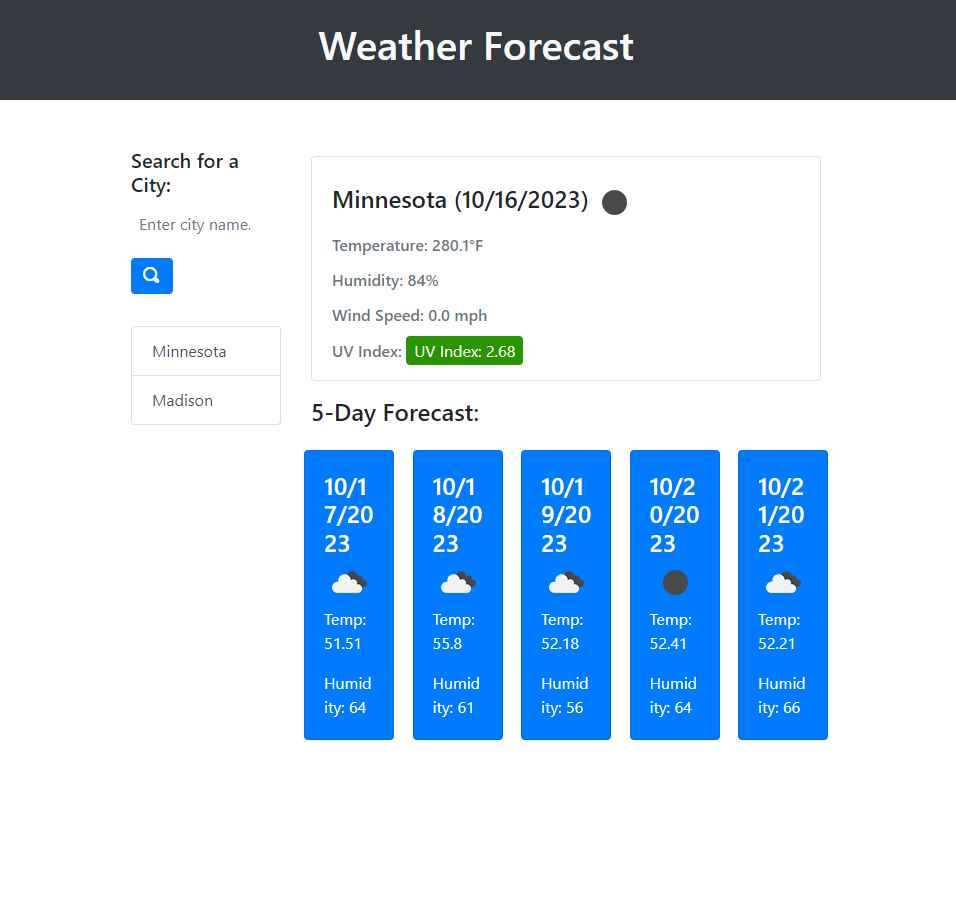

# Weather Forecast Web Application
This is a web application that displays current and future weather information for a city. It uses the OpenWeatherMap API to retrieve weather data and displays the information in a user-friendly interface.

# Usage
To use the web application, follow these steps:
1. Enter the name of a city in the search bar on the left side of the screen.

2. Click the search button to retrieve weather information for the city.

3. The current weather information for the city will be displayed in the main section of the screen.

4. The 5-day forecast for the city will be displayed below the current weather information.

# Features
Displays current weather information, including temperature, humidity, and wind speed.
Displays a 5-day forecast of weather information.
Allows users to search for weather information by city name.

# Technologies Used
HTML
CSS
JavaScript
Bootstrap
jquery
dayjs
OpenWeatherMap API

# Screenshot
